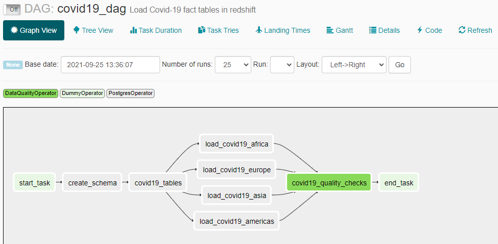

# Data Pipelines

## Overview
There are five Airflow data pipelines which load data into an AWS Redshift data warehouse. The dimension_dag loads the countries from all three datasets into staging tables and then into a final dimension table.  The gapminder_staging_dag and covid19_staging_dag are responsible for loading gapminder and covid19 daily case data into their respective staging tables.  The gapminder_dag and covid19_dag loads data into fact tables of the Redshift database called world-demographics.

These five DAGs need to run in the following sequence.

## gapminder_staging_dag

The gapminder files are in a normalized three-column format. Each file will contain a single indicator column along with country and year. The `gapminder_staging_dag` will take these individual files and merge them into new files, each one representing a different demographic category.  

The merged output files are:

* gdp.csv
* females.csv
* males.csv
* education.csv
* governnment.csv
* population.csv

The merged output files get loaded into staging tables in the AWS Redshift world-demographics database.

## covid19_staging_dag

The covid-19 daily case files can have one of four header layouts. The files for each header
type are stored in four separate S3 folders. There are four separate Redshift Copy commands, each of which loads CSV files from its source folder into the covid-19 staging table.  Each copy command is followed by a data quality check task before moving on to the next Redshift Copy task.

## dimension_dag

The `dimension_dag` is responsible for merging the countries from the gapminder and covid-19 datasets into a common dimension table.  An independent list of country names are loaded into a staging table and pattern matching is done to consolidate the countries common to all three sources.

## gapminder_dag

The data from the gapminder staging tables is combined to form a single fact table called 
`global.world_demographics` with a surrogate key called country id.  The country_id field is a 
reference column (foreign key) in the fact tables.

## covid19_dag

Four separate insert statements are run to load the staging data into four separate region fact tables. Each insert statement joins to the `global.world_countries` dimension table to insert daily case records for countries within a specific region.

## Setup Instructions for running DAGs in Airflow
<a href="Setup%20Instructions.md" target="_blank">Setup Instructions</a>

